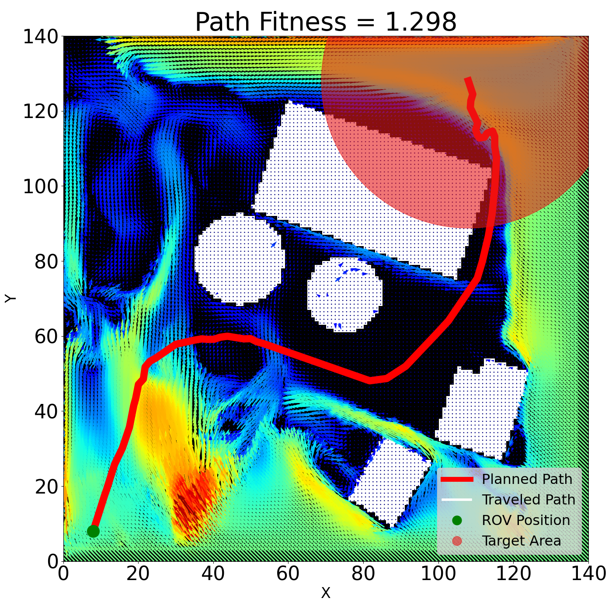

# GA path planning with ocean currents

### Exploring the generation of ocean-current-aware trajectories through a known 2D environment via genetic algorithm.

## Overview

Prototype implementation of a trajectory planning algorithm for an Autonomous Underwater Interception Drone (AUID) to reach a target of which it only knows an approximate heading by leveraging ocean currents to minimize travel time.

This project uses Python for readability and ease of implementation. Be aware, that runtimes can exceed 10 minutes and deploying it in the real world would necessitate basing it on faster technologies.

## Prerequisites

- python

## Usage

1. open main.py and choose a demo function to run.
2. python3 main.py
